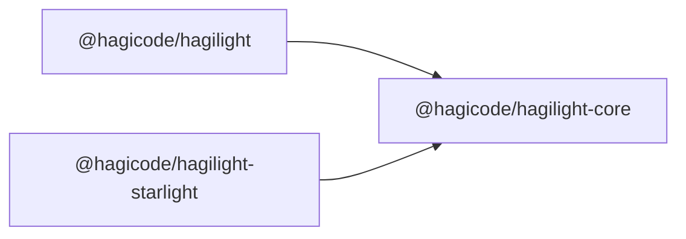

# HagiLight

[](https://www.npmjs.com/package/@hagicode/hagilight)
[](https://www.npmjs.com/package/@hagicode/hagilight-core)
[](https://www.npmjs.com/package/@hagicode/hagilight-starlight)

[](https://github.com/HagiCode-org/hagilight/actions/workflows/ci.yml)
[](https://github.com/HagiCode-org/hagilight/actions/workflows/npm-publish.yml)
[](https://github.com/HagiCode-org/hagilight/releases)
[](https://github.com/HagiCode-org/hagilight/commits/main)
[](https://www.typescriptlang.org/)
[](https://astro.build/)
[](https://docs.npmjs.com/generating-provenance-statements)
[](https://hagilight.hagicode.com)
[](https://hagistar.hagicode.com)

Reusable Astro components, integrations, and a Starlight plugin for HagiCode
sites. This repository publishes three npm packages, all authored in
TypeScript and shipped as ESM with generated `.d.ts` declarations. Astro
components, Astro route entry points, styles, JSON, and images are shipped in
their native formats.



Both feature packages depend on the matching version of the shared core and
never on each other. Install core directly when your site imports a core entry
point.

| Package | npm | Downloads |
| --- | --- | --- |
| [`@hagicode/hagilight-core`](https://www.npmjs.com/package/@hagicode/hagilight-core) | [](https://www.npmjs.com/package/@hagicode/hagilight-core) | [](https://www.npmjs.com/package/@hagicode/hagilight-core) |
| [`@hagicode/hagilight`](https://www.npmjs.com/package/@hagicode/hagilight) | [](https://www.npmjs.com/package/@hagicode/hagilight) | [](https://www.npmjs.com/package/@hagicode/hagilight) |
| [`@hagicode/hagilight-starlight`](https://www.npmjs.com/package/@hagicode/hagilight-starlight) | [](https://www.npmjs.com/package/@hagicode/hagilight-starlight) | [](https://www.npmjs.com/package/@hagicode/hagilight-starlight) |

## `@hagicode/hagilight-core`

Shared building blocks for plain Astro and Starlight sites. Requires `astro`
`^6.0.7 || ^7.3.5`; it has no Starlight dependency.

| Import | Provides |
| --- | --- |
| `@hagicode/hagilight-core/links` | `resolveSiteLinks()` and the localized header/footer link catalog types |
| `@hagicode/hagilight-core/favicon` | `resolveFaviconHeadEntry()` and `getHagilightFaviconDataUri()` |
| `@hagicode/hagilight-core/seo` | Metadata, canonical head composition, and JSON-LD builders |
| `@hagicode/hagilight-core/seo-schema` | `seoSchema` for optional `seo` frontmatter |
| `@hagicode/hagilight-core/rss` | `generateRssFeed()` and `resolveRssLocales()` |
| `@hagicode/hagilight-core/rss-ownership` | Coordination that keeps one integration as the RSS route owner |
| `@hagicode/hagilight-core/promotions` | Typed promotion campaign loader |
| `@hagicode/hagilight-core/Footer` | Localized footer with generated RSS and sitemap links |
| `@hagicode/hagilight-core/Copyright`, `/PromotoBanner`, `/GoogleAnalytics`, `/Analytics51LA` | Astro components |
| `@hagicode/hagilight-core/logo.png`, `/favicon.ico` | Brand assets |

## `@hagicode/hagilight`

Plain Astro integrations and components (`astro` `^6.0.7 || ^7.3.5`):

| Import | Provides |
| --- | --- |
| `@hagicode/hagilight/integration` | `hagilight()` (sitemap, robots.txt, and RSS feeds by default), `hagilightFavicon()`, and their option types |
| `@hagicode/hagilight/SEOHead` | Canonical, Open Graph, Twitter, and JSON-LD head entries |
| `@hagicode/hagilight/Footer` | Shared footer with `Powered By hagilight@<version>` attribution |

The plain-Astro Footer reads the exact build-time `version` from its own
`@hagicode/hagilight` package manifest; it does not report an `astro` framework
version. Existing sites that import `@hagicode/hagilight-core/Footer` can keep
that core-only footer (with no feature-package attribution) or switch to
`@hagicode/hagilight/Footer` to display the Hagilight version.

## `@hagicode/hagilight-starlight`

A Starlight plugin (`@astrojs/starlight` `^0.42.4`, `astro` `^7.3.5`) that adds
the localized header, language chooser, and footer links; content-width toggle;
custom 404 page; end-of-article HagiCode introduction; floating promotion
banner; AI translation or authorship disclosures; SEO metadata and multilingual
page discovery; RSS feeds; Google Analytics and 51LA; and the shared favicon.
Its Footer appends `Powered By hagilight-starlight@<version>` using the exact
build-time version from the `@hagicode/hagilight-starlight` manifest, not the
Astro or Starlight dependency version.

```js
// astro.config.mjs
import { defineConfig } from 'astro/config';
import starlight from '@astrojs/starlight';
import hagilight from '@hagicode/hagilight-starlight';
import { locales } from '@hagicode/hagilight-starlight/locales';

export default defineConfig({
  site: 'https://docs.example.test',
  integrations: [starlight({ title: 'Docs', locales, plugins: [hagilight({ rss: { includeDocs: false } })] })],
});
```

```ts
// src/content.config.ts
import { defineCollection } from 'astro:content';
import { docsLoader } from '@astrojs/starlight/loaders';
import { docsSchema } from '@astrojs/starlight/schema';
import { hagilightSchema } from '@hagicode/hagilight-starlight/schema';

export const collections = { docs: defineCollection({ loader: docsLoader(), schema: docsSchema({ extend: hagilightSchema }) }) };
```

`HagilightStarlightOptions` types every plugin option, so misspelled or
mistyped options fail type-checking in `astro.config.ts` or JSDoc-checked
configs; the plugin still validates options at runtime. Components such as
`@hagicode/hagilight-starlight/Header` and `/MarkdownContent` remain importable
for sites that compose their own Starlight overrides.

## TypeScript usage

Every JavaScript entry point has a `types` export condition, so TypeScript
resolves declarations with `moduleResolution` `NodeNext`, `Node16`, or
`Bundler` without application-level module declarations. For example, type the
module passed to `hagilight({ rss: { getFeed } })`:

```ts
// src/rss-feed.ts
import type { RssFeedCallback } from '@hagicode/hagilight/integration';

const getFeed: RssFeedCallback = async ({ lang }) => ({
  title: 'Updates',
  description: `Updates in ${lang}`,
  items: [{ title: 'Release notes', link: '/blog/release/', date: new Date() }],
});
export default getFeed;
```

## Local development

Run commands from the repository root:

```sh
npm install
npm run build              # tsc -b: core, then @hagicode/hagilight and the Starlight package
npm run typecheck          # build, check Astro route entry points, and check test/types fixtures
npm test                   # builds first, then runs node --test
npm run build:example      # builds packages and both examples, then verifies their output
npm run pack:check         # verifies all three tarballs, exports, and version alignment
npm run integration:installed  # installs tarballs into isolated core, Astro, and Starlight consumers
```

Sources live in `packages/*/src/*.ts` and compile to the ignored
`packages/*/dist/` directories; `.astro` components and route files import the
built `dist/*.js` modules, so build before running examples from a clean
checkout. The release workflow stamps one version into all three packages and
the core dependency of both feature packages (`scripts/release.mjs stamp`), then
`scripts/publish.mjs` publishes core first, followed by the plain-Astro and
Starlight packages.

## Sitemap and robots.txt for plain Astro

Register the plain-Astro integration in `astro.config.mjs` (importing a component alone
cannot register an Astro integration):

```js
import { defineConfig } from 'astro/config';
import { hagilight } from '@hagicode/hagilight/integration';

export default defineConfig({
  site: 'https://example.test',
  integrations: [hagilight()],
});
```

With an absolute HTTP(S) `site`, Astro's sitemap integration generates
`sitemap-index.xml` and Hagilight generates `robots.txt` with an absolute
`Sitemap:` URL to that index. For `base: '/manual/'`, verify
`https://example.test/manual/sitemap-index.xml` and the sitemap entries under
`https://example.test/manual/`; the localized Footer sitemap link uses that
same base-aware path. Set `hagilight({ enabled: false })` to disable both
generated outputs. An existing `@astrojs/sitemap` integration or Starlight owns
sitemap generation instead; a consumer-owned `public/robots.txt` or
`src/pages/robots.txt.*` remains authoritative.

If you need a site-specific crawl policy, own `public/robots.txt` and include
the absolute URL of the deployed sitemap index:

```text
User-agent: *
Allow: /
Disallow: /private/
Sitemap: https://example.test/manual/sitemap-index.xml
```

Hagilight does not generate `llms.txt`. To publish AI discovery links, add your
own `public/llms.txt` with only the localized pages you want to expose:

```text
# Example documentation

- [English](https://example.test/manual/)
- [简体中文](https://example.test/manual/zh-CN/)
```

If you do not want AI discovery, do not add an `llms.txt` file. Deployments
under a `base` path must still serve `/robots.txt` at the origin root, because
crawlers look for that exact URL.

## Localized RSS for plain Astro

`hagilight()` from `@hagicode/hagilight/integration` generates localized RSS feeds
by default, so integrating it is enough to publish `/rss.xml` and
`/rss.<language>.xml`. Sites can keep owning RSS routes and call
`generateRssFeed` from `@hagicode/hagilight-core/rss`, or customize the generated
feeds with the `rss` option:

```js
import { defineConfig } from 'astro/config';
import { hagilight } from '@hagicode/hagilight/integration';

export default defineConfig({
  site: 'https://example.test',
  integrations: [
    hagilight({
      rss: { getFeed: './src/rss-feed.ts' },
    }),
  ],
});
```

When `rss` is omitted (the default) or `rss: true`, the integration derives the
feed locales from the Astro `i18n` config and serves a built-in empty feed.
Pass `rss: false` to disable RSS entirely. The `getFeed` path is resolved
relative to the Astro project root. Its module must default-export an
`RssFeedCallback` that receives `{ route, lang }` for each configured locale and
returns `{ title, description, items }`. Items use the same `title`, `link`,
optional `description`, and optional `date`/`pubDate` shape accepted by
`generateRssFeed`. The integration requires an absolute HTTP(S) `site` URL and a
valid callback module and result when `getFeed` is supplied.

The integration prerenders `/rss.xml`, `/rss.en.xml`, and
`/rss.<language>.xml` for each configured non-English language. `/rss.xml` and
`/rss.en.xml` use the configured English callback result. If no English locale
is configured, both are valid empty English feeds; Hagilight does not invoke a
different language's callback or borrow its content. A generated filename
conflicting with a page or public file fails the build rather than replacing
consumer-owned output. Setting `rss: false` leaves route and Footer behavior
unchanged.

Generated route and item URLs honor Astro's `base`, for example
`base: '/manual/'` generates `/manual/rss.xml` and resolves relative item links
under `https://example.test/manual/`. The core `Footer` gets the default feed
link and, on configured non-English pages, a current-language link from
request-local integration context. Explicit `links.rssFeedUrl`,
`links.rssLocaleFeedUrl`, link overrides, and existing removal options remain
authoritative.

When both Hagilight integrations are active, Starlight remains the sole RSS
owner if its RSS generation is enabled; the plain-Astro `hagilight()` then adds
neither routes nor Footer URLs. Both packages coordinate through
`@hagicode/hagilight-core/rss-ownership`. Having both packages installed does not enable
either integration. If the Starlight integration is present with RSS explicitly
disabled, the plain-Astro `hagilight()` owns the RSS routes instead.

## Desktop viewport regression baseline

Install the Chromium browser once with `npx playwright install chromium`, then run `npm run test:viewport` from the Hagilight repository root. The command builds and serves both example sites locally before checking these routes at 1536 x 864, 1920 x 1080, and 2560 x 1440 CSS viewport pixels:

| Example | Routes | Layout states |
| --- | --- | --- |
| Core Astro | `/`, `/zh-CN/` | Header actions, bounded feature cards, internal code-block scrolling, and document overflow |
| Starlight | `/zh-CN/`, `/zh-Hant/` | Header, sidebar, populated page outline, narrow and wide reading widths, and the open language chooser |

The suite blocks external requests, disables optional analytics only for its test build, waits for fonts, and disables animation. On failure it reports the route, viewport, and affected region, then saves a screenshot; CI retains these under `.ci-artifacts/viewport/`.

These dimensions are Chromium CSS viewport pixels at device scale factor 1. They do not emulate macOS display scaling, physical device pixels, Safari, or other browser typography; a real-device/browser pass remains complementary.